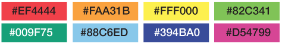

## About

---

Brandcolors.net website clone with react

## Demo

[https://brands-colors.netlify.app/](https://brands-colors.netlify.app/)

---

## Setup

In the project directory, you can run:

```cmd
yarn start
```

## Dependencies

- react-clipboard.js
- react-icons
- react-modal
- react-router-dom
- react-virtualized
- sass
- style-loader

## Calculating Color Contrast

```javascript
const getContrastYIQ = (hexcolor) => {
  var r = parseInt(hexcolor.substr(0, 2), 16);
  var g = parseInt(hexcolor.substr(2, 2), 16);
  var b = parseInt(hexcolor.substr(4, 2), 16);
  var yiq = (r * 299 + g * 587 + b * 114) / 1000;
  return yiq >= 128 ? 'black' : 'white';
};
```



[source](https://24ways.org/2010/calculating-color-contrast)
